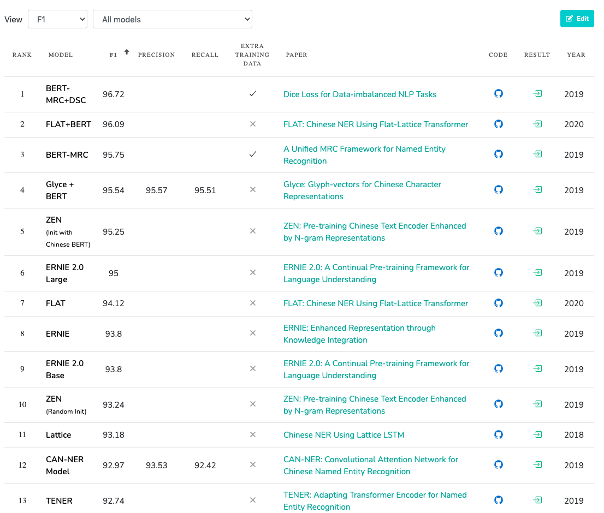
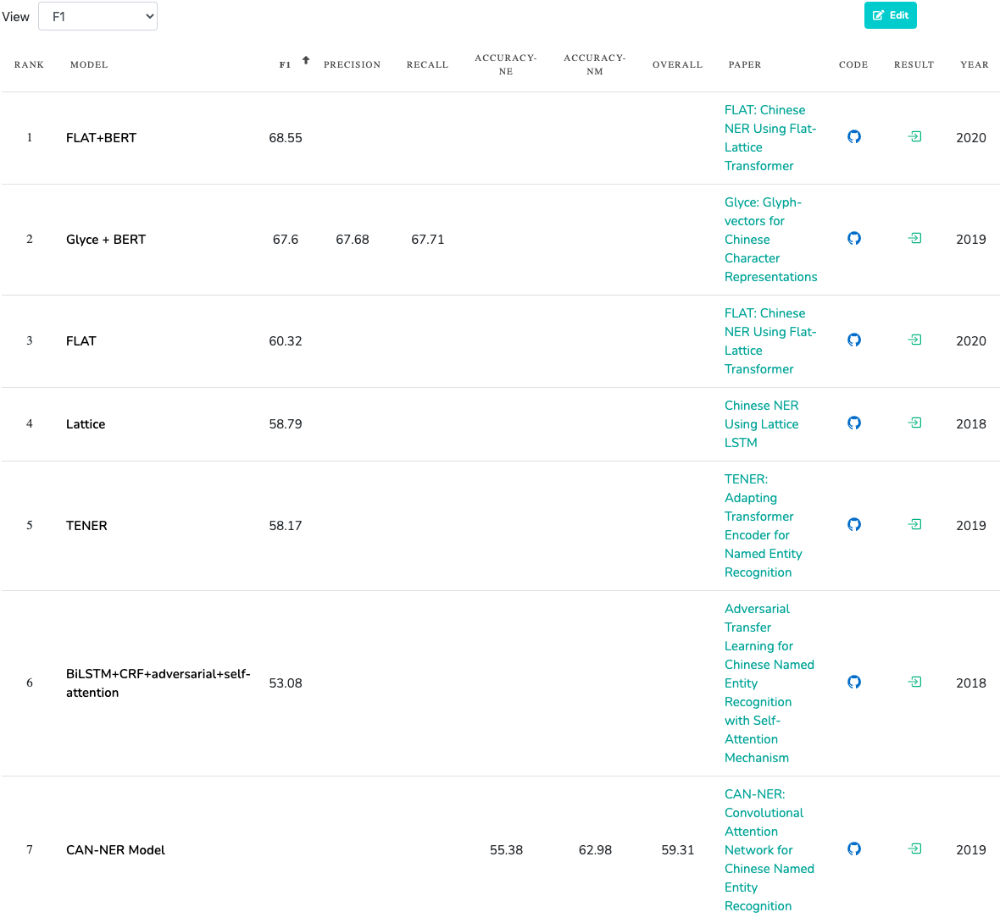
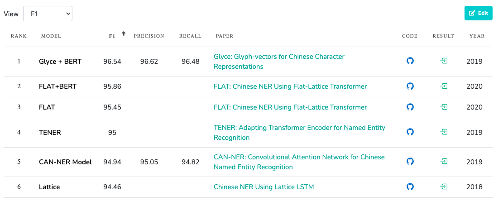

# chinese-ner-datasets
本repo主要记录下中文命名实体识别任务（NER）里面的一些常见的数据集。

## 一、公开数据集
常见的一些NLP任务里面的一些书籍及算法的表现都是能够在paperswithcode网站上面看见。下面的连接就是到了ner各种中文书籍集上面的sota表现。

[https://www.paperswithcode.com/task/chinese-named-entity-recognition](https://www.paperswithcode.com/task/chinese-named-entity-recognition)

### 1.1 MSRA数据集
MSRA是微软的公开数据集。该数据集的具体信息为：

|数据集名称|数据大小|
|:-: | :-: | 
|训练集|12.7 Mb|
|验证集|1.4 Mb|
|测试集|1.1 Mb|

数据是BIO的格式，抽取PER、LOC、ORG

 <div align=center></div>
 
 **下载地址**：  
[http://download.fastnlp.top/dataset/MSRA_NER.zip](http://download.fastnlp.top/dataset/MSRA_NER.zip)
 
### 1.2 人民日报数据集

人民日报语料。

|语料时间|原始语料大小|下载链接|
|:---:|:---:|:---:|
|199801-06|63.52Mb|链接: [ https://pan.baidu.com/s/1GWhIHWWC9lKZALTDqc_ovw](https://pan.baidu.com/s/1GWhIHWWC9lKZALTDqc_ovw)  密码: ec9u|
|200001-12|137.66Mb|链接: [https://pan.baidu.com/s/1tkMLVxJ-p0U4OVbtNL1keQ](https://pan.baidu.com/s/1tkMLVxJ-p0U4OVbtNL1keQ)  密码: d519|
|2014|177.47Mb|链接: [https://pan.baidu.com/s/1OoTogt6zDEeJfimWKnb0zw]( https://pan.baidu.com/s/1OoTogt6zDEeJfimWKnb0zw)  密码: n8c3|


例子
```
京华/ntc 时报/n]/nz 讯/ng （/w 记者/nnt 李秋萌/nr ）/w 昨天/t ，/w 记者/nnt 从/p [朝阳区/ns 政府/nis]/nto 了解到/v ，/w 为/p 缓解/v 百姓/n 买菜/nz 难/a 、/w 买菜/nz 贵/a 问题/n ，/w 将/d 于/p 2014年/t 新增/v [50/m 个/q]/mq 左右/f 菜/n 站/vi ，/w 并/cc 在/p 每个/r 街道/ns 配/v 建/v [2/m 个/q]/mq 公益性/n 蔬菜/n 零售点/n 。/w
```

可以根据所需要抽取的实体，来编写程序输入到模型里面去训练，得到你想要数据。

### 1.3 BosonNLP数据集
主要是2000条的新闻数据，可以抽取人名、地名、组织名、公司名、产品名、时间：

|抽取字段|人名|地名|组织名|公司名|产品名|时间|
|:---:|:---:|:---:|:---:|:---:|:---:|:---:|
|标签|person_name|location|org_name|company_name|product_name|time|

数据比较少，用模型做出来的效果不是非常好。

 **下载地址**：   
 [https://github.com/quincyliang/nlp-public-dataset/tree/master/ner-data/boson](https://github.com/quincyliang/nlp-public-dataset/tree/master/ner-data/boson)

### 1.4 WeiboNER

对人名、地名、机构名等4种实体进行抽取。数据不是特别多。

 <div align=center></div>

 **下载地址**： 
 
[http://download.fastnlp.top/dataset/weibo_NER.zip](http://download.fastnlp.top/dataset/weibo_NER.zip)

### 1.5 Resume NER
 
 
  <div align=center></div>
 
 **下载地址**：  
 [https://github.com/YiDai-03/Chinese_NLP_Dataset/tree/master/Resume-NER](https://github.com/YiDai-03/Chinese_NLP_Dataset/tree/master/Resume-NER)

### 1.6 SighanNER

数据是BIO的格式，抽取PER、LOC、ORG

**下载地址**：  
[https://github.com/yzwww2019/Sighan-2006-NER-dataset](https://github.com/yzwww2019/Sighan-2006-NER-dataset)

### 1.7 OntoNotes

该数据需要自行去申请。具体的操作可以去网上搜索一下如何获取OntoNotes的数据集。

## 二、竞赛数据集

竞赛相关数据需要小伙伴自己去找一下，这里我就不放任何的数据集下载的链接了。

### 2.1 CCKS-面向电子病历的命名实体识别系列
**竞赛连接**：  
[https://www.biendata.xyz/competition/CCKS2017_2](https://www.biendata.xyz/competition/CCKS2017_2)  
[https://www.biendata.xyz/competition/CCKS2018_1](https://www.biendata.xyz/competition/CCKS2018_1)    
[https://www.biendata.xyz/competition/ccks_2019_1](https://www.biendata.xyz/competition/ccks_2019_1)
[https://www.biendata.xyz/competition/ccks_2020_2_1](https://www.biendata.xyz/competition/ccks_2020_2_1)
[https://www.biendata.xyz/competition/chip_2020_1](https://www.biendata.xyz/competition/chip_2020_1)

**赛题任务**：  
对于给定的一组电子病历文档（纯文本文件），任务的目标是识别并抽取出与医学临床相关的实体名字（entity mention），并将它们归类到预先定义好的类别（pre-defined categories），比如疾病、症状、检查等。

### 2.2 互联网金融新实体发现
**竞赛连接**:  
[https://www.datafountain.cn/competitions/361](https://www.datafountain.cn/competitions/361)  

**赛题任务**：   
从提供的金融文本中识别出现的未知金融实体，包括金融平台名、企业名、项目名称及产品名称。
持有金融牌照的银行、证券、保险、基金等机构、知名的互联网企业如腾讯、淘宝、京东等和训练集中出现的实体认为是已知实体。

### 2.3 文本实体识别及关系抽取
**竞赛连接**:  
[https://www.datafountain.cn/competitions/371](https://www.datafountain.cn/competitions/371)

**赛题任务**：  
本赛题利用经过特定处理的公共数据集SemEval2010，数据集中的文本共包括9种实体关系，希望参赛者可以对句子进行实体抽取，并根据语义及其他信息来判断实体之间的关系

### 2.4 第二届海南大数据创新应用大赛 - 智能算法大赛
**竞赛连接**:  
[https://tianchi.aliyun.com/competition/entrance/231771/introduction](https://tianchi.aliyun.com/competition/entrance/231771/introduction)

**竞赛任务**:    
脱敏之后的简历数据，需要抽取18个字段的实体。